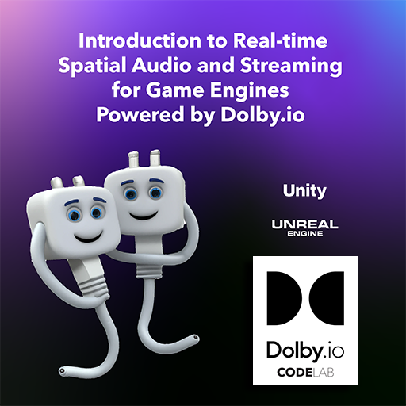

<!-- _coverpage.md -->
<!-- background image -->

# Introduction to Real-time Spatial Audio and Streaming for Game Engines | Dolby.io CodeLab

> Workshop presented by Dolby.io Developer Relations Team - MIT Reality Hack 2023

[GitHub Project](https://github.com/dolbyio-samples/workshop-game-engines.git)
[Get Started](#introduction-real-time-spatial-audio-and-streaming-for-game-engines)

<!-- background color -->

