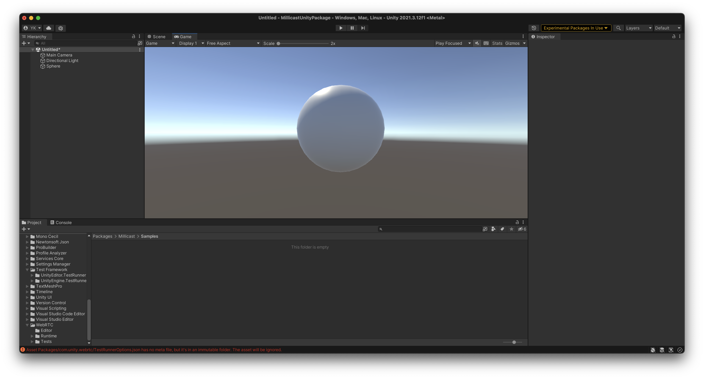
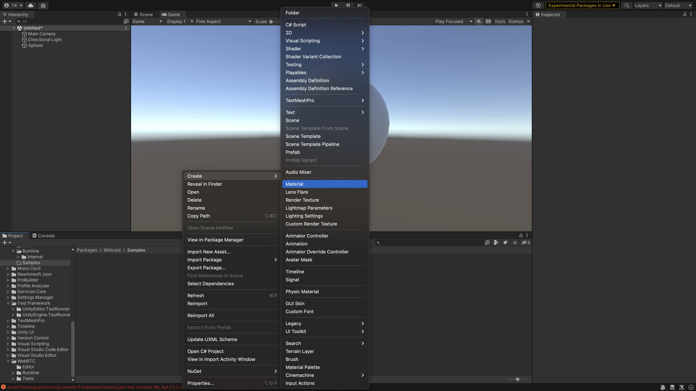
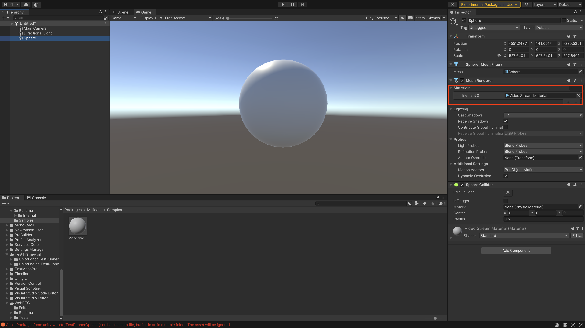
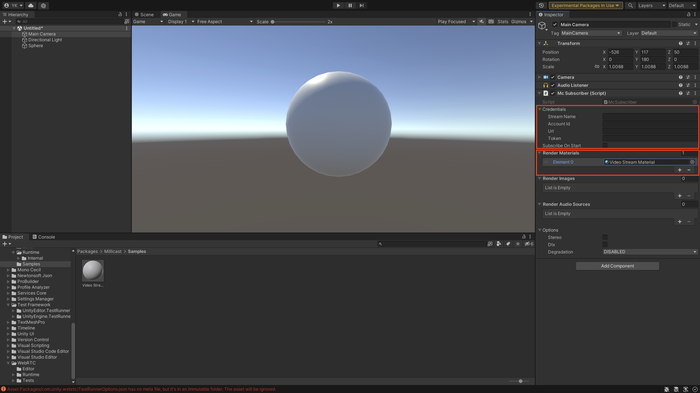
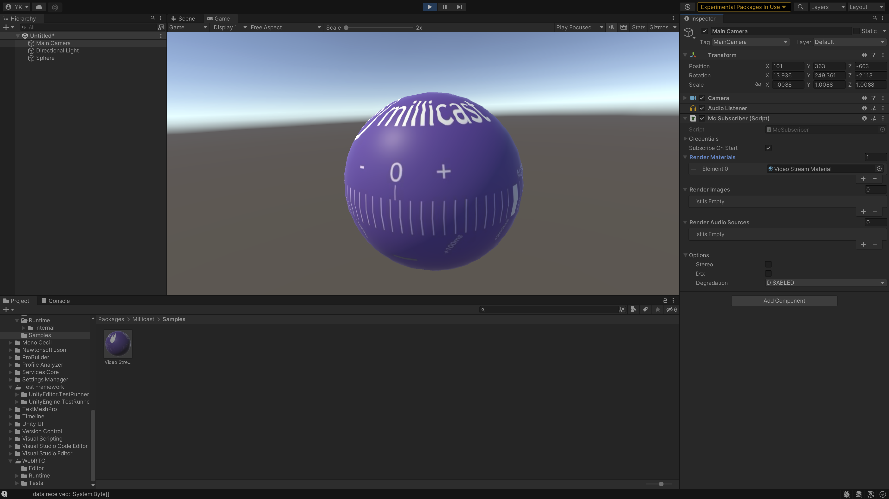

# Rendering with Materials

### Overview
This article explains how to perform rendering of video streams onto materials. Previously, we saw how we could render local and incoming streams onto RawImage, which is a GUI component. While this the only approach suitable for GUI based scenes, sometimes it is useful to render onto materials, that are attached to 3D objects. An example usecase is creating a curved screen to display the incoming stream inside your game. This article will discuss both the inspector UI approach (with no scripting) as well as the scripting API available.


### Using the McSubscriber's component on the UI

Let us start with a simple scene that contains a sphere that we will later render an incoming stream onto:


Now let us create a new material, and call it **Video Stream Material** (it can be called whatever you like), and let us apply the material onto the sphere. Make sure that the material's shader is suitable for your application. For example, if you are using Universal Rendering Pipeline (or URP), you shader should be Universal Rendering Pipeline. Otherwise, you can use the Standard shader:




Now that we have an object with a material applied, we now:

* Create an `McSubscriber` component in the scene on any object, but let us choose the main camera as we already have as an example.
* Add the previously created material in the **Render Materials** List in the inspector UI. 
* Remember to also to have a stream already publishing and **remember to add you credentials in the inspector UI** as well.
* Tick the **Subscribe On Start**.




Now, start the scene and observe the rendering mapping onto the sphere: 


?> You are able to apply this material to any 3D objects you like. There is no need to keep adding this material, however you are able to add as many materials with different properties to the subscriber and all of them will receive the same video stream texture. 

?> Certain complex objects require special UV mapping, so make sure you modify the UV mapping on your object to render properly. You can use tools like `ProBuilder` to achieve that.

?> To render onto GUI, you need to use `RawImage` like we did earlier in the documentation.


### Rendering onto materials using the scriping API

Considering you have a script with a subscriber instantiated, you can add materials using the following method: 

```
// Assuming you have an McSubscriber variable called subscriber instantiated before and a Unity Material called material:

subscriber.AddVideoRenderTarget(material);
```

And similarly, you can remove a material and stop rendering it via: 
```
subscriber.RemoveVideoRenderTarget(material);
```