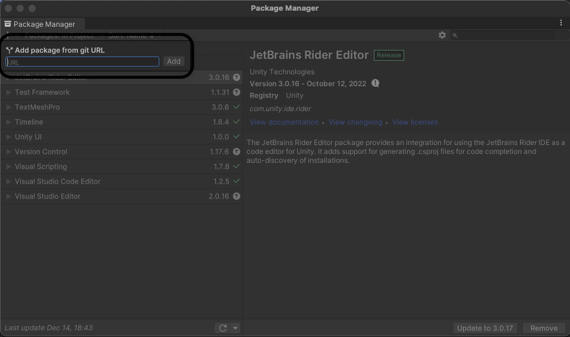
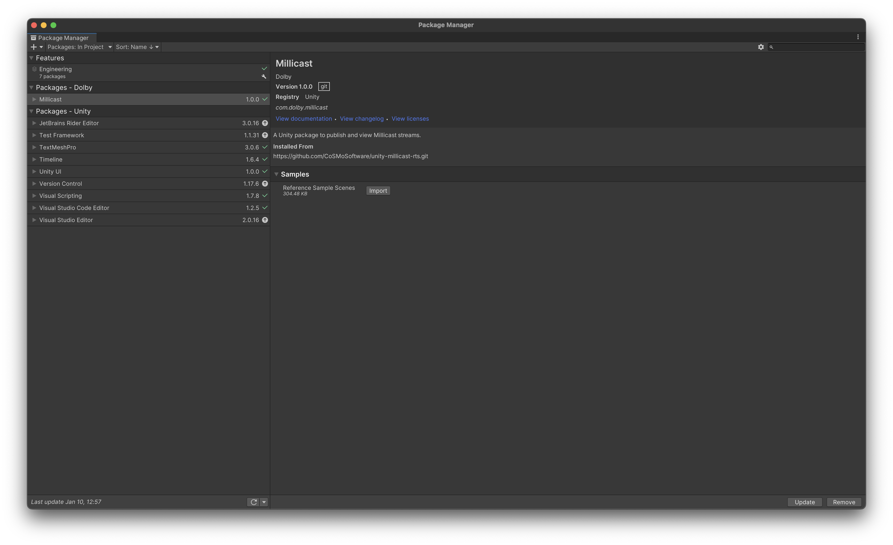
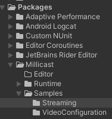
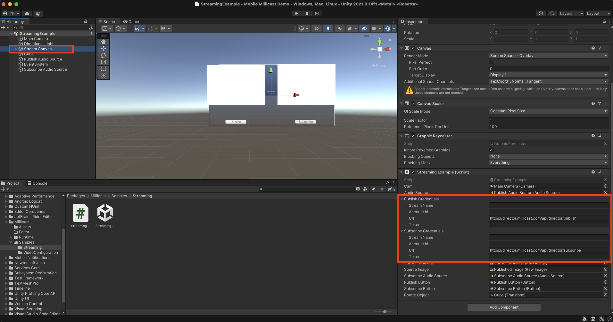
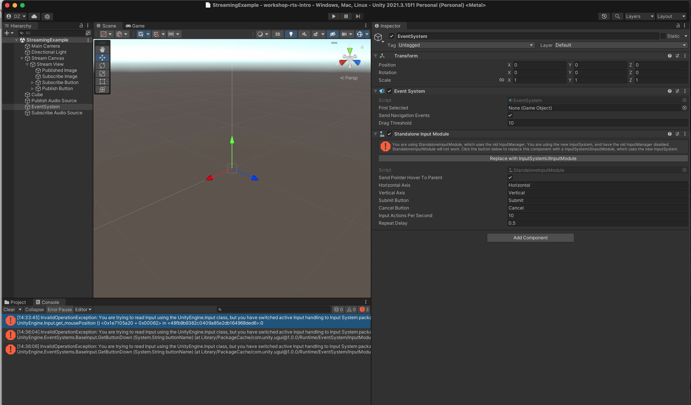

# Real-time Streaming with Unity

Enhance your games with realtime video/audio publishing as well as viewing capabilities. This Unity package acts as a client to the Dolby.io Real-time Streaming Service. 

#### Requirements:
* Unity Engine / Editor Versions: Unity 2019.4, 2020.3, 2021.3
* Development Platform: Windows, Linux, MacOS (Intel and Apple Silicon)
* Target Platform: Desktop
  * Pending Support:(iOS and Android (ARM64 and ARMv7)

#### Unsupported Platforms
* Windows UWP
* building for the iOS Simulator
* WebGL 

#### Get The Code:
GitHub Repo:
* [Real-time Streaming SDK for Unity](https://github.com/CoSMoSoftware/unity-millicast-rts)

?> You may find package names and references referring to the Dolby.io Real-Time Streaming (RTS) product as Millicast, for the purposes of this workshop; **RTS** and **Millicast** are the same service from Dolby.io

### Getting Started with the Unity Millicast Package
#### Installation Overview
The Millicast Unity package allows game developers to publish and view streams from the Millicast service from within their Unity games. For example, users can publish scenes captured from their in-game cameras, as well as audio sources, for other viewers to subscribe to, as well as rendering video and audio streams incoming from the service onto textures and audio sources. 

*This section will be updated when we make the repo public and publish the package. 

#### Installing the package
  * Create and open a new project - for the workshop we suggest using the Third-Person Template.
  * Open the Package Manager From the editor; Window -> Package Manager and click the + to add package from GitURL and insert the following https://github.com/CoSMoSoftware/unity-millicast-rts.git into the add the package by git URL. 

To also import the Sample Scenes, you can click on the Samples menu item in the same package manager window and click on Import as follows: 

  * The window will update and you can verify that the Packages-Dolby -> Millicast (RTS) package was installed.
  * Close the editor.

?> Since this package is not yet published, we will have to perform this extra step:
After installing, go into where the package is cached, which is generally within the project root: **Library/PackageCache** on Mac, and copy the **com.dolby.millicast[XXXX]** folder into the **Packages** folder under the project root. This is to allow us to run the sample scenes embedded in the package. 

#### Get Up And Running:

#### Running the Streaming Sample Scene
The package contains some scenes to help developers understand the functionality of the package, as well as get familiar with using the APIs. We will look at a simple publish and subscribe example, so let us follow the steps:
Head over to the Samples folder within the Millicast package, and open the StreamingExample scene. This scene contains a UI menu that is publishing a camera feed of an cube in front of the camera and the menu, and allows us to subscribe and view that on a rendering texture. 

On the Scene Hierarchy  on the left, click on the Stream Canvas so that we can view the example script settings on the inspector UI on the right. Input the streaming credentials under Publish Credentials  and Subscribe Credentials.  For publish credentials, you only need to set the stream name and token, and for subscribe credentials you will need the stream name and account ID only. 

#### Hit Play to run the example

Once done, hit the start button (right arrow) in the center at the top to start the scene, when you click on publish, you will publish the camera scene as well as an audio source playing a sine wave to the Millicast service. 

You will see the camera feed rendered on the left as well. When you click subscribe, you will subscribe to that same stream incoming from the Millicast service, and render it. 
You can understand how to use the publisher and viewer scripts by looking at the StreamingExample.cs  script which is what we just saw running.

Now that you understand how to integrate the package and the basic usage, let us understand the publisher and subscriber scripts in more detail, and the basic API in the [next section](content/unity-streaming/understanding-rts.md).

#### Resources:
* Real-time Streaming SDK for Unity API Documentation of the classes, structs, unions and interfaces 
  * [API Class Documentation](https://cosmosoftware.github.io/unity-millicast-rts/Documentation/html/annotated.html)

#### Next Steps:
* [Learn more about the Publisher and Subscriber scripts](content/unity-streaming/understanding-rts.md)
* Create a multiplayer experience or game
* Add Real-time Spatial Audio and Communications to this example

#### Troubleshooting
?> Note if you get a runtime error for the input system - you'll need to update the project to use the new input system.   Select the EventSystem game object and click the "replace with Input System" button to fix the error.

 
### Next Section:
* [Understanding the Publisher and Subscriber scripts](content/unity-streaming/understanding-rts.md)